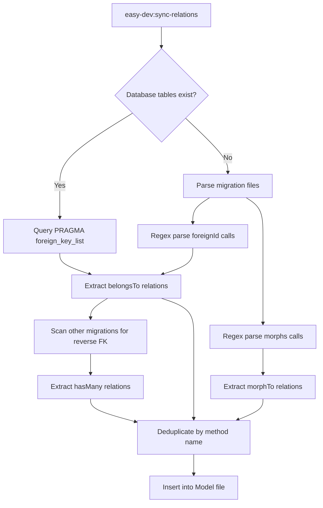

# 🚀 Laravel Easy Dev v2

[](https://packagist.org/packages/anas/easy-dev)
[](https://packagist.org/packages/anas/easy-dev)
[](LICENSE.md)

**Laravel Easy Dev** is a powerful code generation toolkit that supercharges your Laravel development. Generate complete CRUD systems with Repository & Service patterns, auto-detect model relationships, create policies, DTOs, observers, filters, enums, and more — all with a beautiful interactive CLI.

---

## 📋 Table of Contents

- [Features](#-features)
- [Requirements](#-requirements)
- [Installation](#-installation)
- [Quick Start](#-quick-start)
- [Commands Reference](#-commands-reference)
  - [CRUD Generation](#1-easy-devcrud)
  - [Interactive CRUD](#2-easy-devmake)
  - [Policy Generator](#3-easy-devpolicy)
  - [DTO Generator](#4-easy-devdto)
  - [Observer Generator](#5-easy-devobserver)
  - [Filter Generator](#6-easy-devfilter)
  - [Enum Generator](#7-easy-devenum)
  - [Repository Generator](#8-easy-devrepository)
  - [API Resource Generator](#9-easy-devapi-resource)
  - [Relationship Sync](#10-easy-devsync-relations)
  - [Add Relation](#11-easy-devadd-relation)
  - [Help](#12-easy-devhelp)
- [Generated Architecture](#-generated-architecture)
- [Dry-Run Mode](#-dry-run-mode)
- [Configuration](#%EF%B8%8F-configuration)
- [Customizing Stubs](#-customizing-stubs)
- [Relationship Detection](#-relationship-detection)
- [Real-World Workflows](#-real-world-workflows)
- [Testing](#-testing)
- [Contributing](#-contributing)
- [License](#-license)

---

## ✨ Features

| Feature | Description |
|---------|-------------|
| 🏗️ **CRUD Generation** | Model, Migration, Controllers (API + Web), Requests, Resources, Routes |
| 🗄️ **Repository Pattern** | Repository + Interface with full CRUD method signatures |
| 🔧 **Service Layer** | Service + Interface with business logic separation |
| 🛡️ **Policies** | Authorization policy with `viewAny`, `view`, `create`, `update`, `delete`, `restore`, `forceDelete` |
| 📦 **DTOs** | Data Transfer Objects with `fromRequest()`, `fromModel()`, `toArray()` |
| 👁️ **Observers** | Model lifecycle hooks: `creating`, `created`, `updating`, `updated`, `deleting`, `deleted` |
| 🔍 **Query Filters** | Reusable filter classes with `apply()` method |
| 🏷️ **Enums** | PHP 8.1+ string-backed enums with `values()` and `label()` helpers |
| 🔄 **Relationship Detection** | Auto-detect `belongsTo`, `hasMany`, `morphTo`, `morphMany` from schema |
| 🔮 **Dry-Run Mode** | Preview all files before creating — nothing is written to disk |
| ↩️ **Rollback** | Automatic cleanup on generation failure |
| 🎨 **Beautiful CLI** | Progress bars, colored output, interactive wizard |

---

## 📋 Requirements

- **PHP** 8.1 or higher
- **Laravel** 9.x / 10.x / 11.x / 12.x
- **Database** MySQL, PostgreSQL, or SQLite

---

## 📦 Installation

```bash
composer require anas/easy-dev --dev
```

The package auto-registers via Laravel package discovery. No manual setup needed.

### Publish Configuration (optional)

```bash
php artisan vendor:publish --tag=easy-dev-config
```

### Publish Stubs (optional)

```bash
php artisan vendor:publish --tag=easy-dev-stubs
```

Stubs are copied to `resources/stubs/vendor/easy-dev/` where you can customize them.

---

## 🚀 Quick Start

```bash
# 1. Generate a complete CRUD for "Product"
php artisan easy-dev:crud Product

# 2. Run the generated migration
php artisan migrate

# 3. Check your routes
php artisan route:list --path=products
```

That's it! You now have a Model, Migration, Web Controller, API Controller, Form Requests, API Resources, and Routes — all generated and ready to use.

---

## 📖 Commands Reference

### 1. `easy-dev:crud`

**The core command.** Generates a complete CRUD system for a model.

```bash
php artisan easy-dev:crud {model} [options]
```

#### Options

| Option | Description |
|--------|-------------|
| `--with-repository` | Generate Repository pattern (Repository + Interface) |
| `--with-service` | Generate Service layer (Service + Interface) |
| `--with-policy` | Generate authorization Policy |
| `--with-dto` | Generate Data Transfer Object |
| `--with-observer` | Generate model Observer |
| `--api-only` | Generate only API controller and routes (no web) |
| `--web-only` | Generate only web controller and routes (no API) |
| `--without-interface` | Skip Interface generation for Repository/Service |
| `--dry-run` | Preview files without creating them |

#### Examples

```bash
# Basic CRUD (Model + Migration + Controllers + Requests + Resources + Routes)
php artisan easy-dev:crud Post

# Full architecture stack
php artisan easy-dev:crud Order --with-repository --with-service --with-policy --with-dto --with-observer

# API-only with service layer
php artisan easy-dev:crud Product --api-only --with-service

# Preview what would be generated
php artisan easy-dev:crud Invoice --with-repository --with-service --dry-run
```

#### Generated Files (basic)

| File | Path |
|------|------|
| Model | `app/Models/Post.php` |
| Migration | `database/migrations/xxxx_create_posts_table.php` |
| Web Controller | `app/Http/Controllers/PostController.php` |
| API Controller | `app/Http/Controllers/Api/PostApiController.php` |
| Store Request | `app/Http/Requests/StorePostRequest.php` |
| Update Request | `app/Http/Requests/UpdatePostRequest.php` |
| API Resource | `app/Http/Resources/PostResource.php` |
| API Collection | `app/Http/Resources/PostCollection.php` |

#### Additional Files (with flags)

| Flag | Files Generated |
|------|----------------|
| `--with-repository` | `app/Repositories/PostRepository.php`, `app/Repositories/Contracts/PostRepositoryInterface.php` |
| `--with-service` | `app/Services/PostService.php`, `app/Services/Contracts/PostServiceInterface.php` |
| `--with-policy` | `app/Policies/PostPolicy.php` |
| `--with-dto` | `app/DTOs/PostData.php` |
| `--with-observer` | `app/Observers/PostObserver.php` |

---

### 2. `easy-dev:make`

**Interactive CRUD generator** with a guided wizard. Wraps `easy-dev:crud` with a beautiful step-by-step UI.

```bash
# Interactive mode (no arguments — wizard asks questions)
php artisan easy-dev:make

# Non-interactive mode (same options as easy-dev:crud)
php artisan easy-dev:make Product --with-repository --with-service
```

---

### 3. `easy-dev:policy`

Generate an authorization policy for an existing model.

```bash
php artisan easy-dev:policy {model}
```

**Generated file:** `app/Policies/{Model}Policy.php`

**Methods included:**
- `viewAny(User $user)` — List permission
- `view(User $user, Model $model)` — Read permission
- `create(User $user)` — Create permission
- `update(User $user, Model $model)` — Update permission
- `delete(User $user, Model $model)` — Delete permission
- `restore(User $user, Model $model)` — Restore soft-deleted
- `forceDelete(User $user, Model $model)` — Permanently delete

**Usage in controllers:**

```php
$this->authorize('viewAny', Post::class);
$this->authorize('update', $post);
```

---

### 4. `easy-dev:dto`

Generate a Data Transfer Object for a model.

```bash
php artisan easy-dev:dto {model}
```

**Generated file:** `app/DTOs/{Model}Data.php`

**Methods included:**
- `fromRequest(Request $request): self` — Create from validated request
- `fromModel(Model $model): self` — Create from Eloquent model
- `toArray(): array` — Convert to array

**Usage:**

```php
// In a controller
$dto = PostData::fromRequest($request);
$dto = PostData::fromModel($post);
$array = $dto->toArray();
```

---

### 5. `easy-dev:observer`

Generate a model observer with lifecycle hooks.

```bash
php artisan easy-dev:observer {model}
```

**Generated file:** `app/Observers/{Model}Observer.php`

**Hooks included:** `creating`, `created`, `updating`, `updated`, `deleting`, `deleted`

**Register in `AppServiceProvider::boot()`:**

```php
use App\Models\Post;
use App\Observers\PostObserver;

Post::observe(PostObserver::class);
```

Or use the `#[ObservedBy]` attribute (Laravel 10+):

```php
use App\Observers\PostObserver;
use Illuminate\Database\Eloquent\Attributes\ObservedBy;

#[ObservedBy(PostObserver::class)]
class Post extends Model { }
```

---

### 6. `easy-dev:filter`

Generate a query filter class for a model.

```bash
php artisan easy-dev:filter {model}
```

**Generated file:** `app/Filters/{Model}Filter.php`

**Usage:**

```php
// In a controller
$query = Post::query();
$filtered = PostFilter::apply($query, $request->validated());
return PostResource::collection($filtered->paginate());
```

---

### 7. `easy-dev:enum`

Generate a PHP 8.1+ backed enum.

```bash
php artisan easy-dev:enum {name} --values={comma-separated-values}
```

**Generated file:** `app/Enums/{Name}.php`

**Example:**

```bash
php artisan easy-dev:enum OrderStatus --values=pending,processing,shipped,delivered,cancelled
```

**Generated code:**

```php
enum OrderStatus: string
{
    case PENDING = 'pending';
    case PROCESSING = 'processing';
    case SHIPPED = 'shipped';
    case DELIVERED = 'delivered';
    case CANCELLED = 'cancelled';

    public static function values(): array { ... }
    public function label(): string { ... }
}
```

**Usage:**

```php
// In a migration
$table->string('status')->default(OrderStatus::PENDING->value);

// In a model cast
protected $casts = ['status' => OrderStatus::class];

// In code
OrderStatus::values(); // ['pending', 'processing', 'shipped', ...]
OrderStatus::PENDING->label(); // 'Pending'
```

---

### 8. `easy-dev:repository`

Generate repository pattern files for an existing model.

```bash
php artisan easy-dev:repository {model} [--without-interface]
```

**Generated files:**
- `app/Repositories/{Model}Repository.php`
- `app/Repositories/Interfaces/{Model}RepositoryInterface.php`

**Register the binding in a service provider:**

```php
$this->app->bind(
    PostRepositoryInterface::class,
    PostRepository::class
);
```

**Use via dependency injection:**

```php
public function __construct(protected PostRepositoryInterface $repository) {}
```

---

### 9. `easy-dev:api-resource`

Generate API Resource and Collection classes for an existing model.

```bash
php artisan easy-dev:api-resource {model} [--without-collection]
```

**Generated files:**
- `app/Http/Resources/{Model}Resource.php`
- `app/Http/Resources/{Model}Collection.php`

**Usage:**

```php
return new PostResource($post);
return new PostCollection(Post::paginate());
```

---

### 10. `easy-dev:sync-relations`

Auto-detect relationships from your database schema or migration files and add them to models.

```bash
# Sync a specific model
php artisan easy-dev:sync-relations Product

# Sync ALL models
php artisan easy-dev:sync-relations --all
```

**Detects:**
- `belongsTo` — from `foreignId` columns in the model's migration
- `hasMany` — by scanning other migrations for foreign keys referencing this model
- `morphTo` / `morphMany` — from `$table->morphs()` columns

**How it works:**
1. Finds the model's migration file
2. Parses `foreignId()` and `morphs()` calls
3. Scans all other migrations for reverse relationships
4. Adds relationship methods to model files (skips if already exists)
5. Optionally adds reverse relationships to related models

---

### 11. `easy-dev:add-relation`

Manually add a relationship method to an existing model.

```bash
php artisan easy-dev:add-relation {model} {relation} {related-model} [--method=name]
```

**Supported relation types:** `hasOne`, `hasMany`, `belongsTo`, `belongsToMany`, `morphTo`, `morphOne`, `morphMany`

**Example:**

```bash
php artisan easy-dev:add-relation User hasMany Post
# Adds posts() method to User model
# Optionally adds belongsTo inverse on Post model
```

---

### 12. `easy-dev:help`

Display the built-in help guide with all commands, options, and examples.

```bash
php artisan easy-dev:help
php artisan easy-dev:help --examples
```

---

## 🏗️ Generated Architecture

When you run `easy-dev:crud` with all flags, the generated file structure follows clean architecture principles:

```
app/
├── DTOs/
│   └── ProductData.php                    # Data Transfer Object
├── Enums/
│   └── ProductStatus.php                  # PHP 8.1+ Enum
├── Filters/
│   └── ProductFilter.php                  # Query Filter
├── Http/
│   ├── Controllers/
│   │   ├── ProductController.php          # Web Controller
│   │   └── Api/
│   │       └── ProductApiController.php   # API Controller
│   ├── Requests/
│   │   ├── StoreProductRequest.php        # Store Validation
│   │   └── UpdateProductRequest.php       # Update Validation
│   └── Resources/
│       ├── ProductResource.php            # API Resource
│       └── ProductCollection.php          # API Collection
├── Models/
│   └── Product.php                        # Eloquent Model
├── Observers/
│   └── ProductObserver.php                # Model Observer
├── Policies/
│   └── ProductPolicy.php                  # Authorization Policy
├── Repositories/
│   ├── ProductRepository.php              # Repository Implementation
│   └── Contracts/
│       └── ProductRepositoryInterface.php # Repository Interface
└── Services/
    ├── ProductService.php                 # Service Implementation
    └── Contracts/
        └── ProductServiceInterface.php    # Service Interface

database/
└── migrations/
    └── xxxx_create_products_table.php     # Migration

routes/
├── api.php                                # API routes appended
└── web.php                                # Web routes appended
```

---

## 🔮 Dry-Run Mode

Preview exactly what would be generated — without writing a single file:

```bash
php artisan easy-dev:crud Invoice --with-repository --with-service --with-policy --dry-run
```

**Output:**

```
🔍 DRY RUN — Previewing CRUD generation for Invoice...

Files that would be created:

  📄 app/Models/Invoice.php
  📄 database/migrations/*_create_invoices_table.php
  📄 app/Repositories/InvoiceRepository.php
  📄 app/Repositories/Contracts/InvoiceRepositoryInterface.php
  📄 app/Services/InvoiceService.php
  📄 app/Services/Contracts/InvoiceServiceInterface.php
  📄 app/Http/Controllers/Api/InvoiceApiController.php
  📄 app/Http/Resources/InvoiceResource.php
  📄 app/Http/Resources/InvoiceCollection.php
  📄 app/Http/Controllers/InvoiceController.php
  📄 app/Http/Requests/StoreInvoiceRequest.php
  📄 app/Http/Requests/UpdateInvoiceRequest.php
  📄 app/Policies/InvoicePolicy.php

Files that would be modified:
  ✏️  routes/api.php
  ✏️  routes/web.php
  ✏️  app/Providers/RepositoryServiceProvider.php

No files were created or modified (dry-run mode).
```

---

## ⚙️ Configuration

After publishing the config (`php artisan vendor:publish --tag=easy-dev-config`), edit `config/easy-dev.php`:

### Model Namespace

```php
'model_namespace' => 'App\\Models\\',
```

### File Output Paths

```php
'paths' => [
    'models'              => app_path('Models'),
    'controllers'         => app_path('Http/Controllers'),
    'api_controllers'     => app_path('Http/Controllers/Api'),
    'requests'            => app_path('Http/Requests'),
    'repositories'        => app_path('Repositories'),
    'repository_contracts' => app_path('Repositories/Contracts'),
    'services'            => app_path('Services'),
    'service_contracts'   => app_path('Services/Contracts'),
    'migrations'          => database_path('migrations'),
],
```

### Route Configuration

```php
'routes' => [
    'api_prefix'          => 'api',
    'web_prefix'          => '',
    'web_middleware'       => ['web'],
    'api_middleware'       => ['api'],
    'route_model_binding' => true,
],
```

### Default Options

Set defaults so you don't repeat flags every time:

```php
'defaults' => [
    'with_repository'          => false,  // Set true to always generate repos
    'with_service'             => false,  // Set true to always generate services
    'with_interface'           => true,   // Generate interfaces by default
    'generate_api_controller'  => true,   // Generate API controllers
    'generate_web_controller'  => true,   // Generate web controllers
],
```

### Validation Rules

Auto-generated validation rules based on column types:

```php
'validation' => [
    'rules' => [
        'string'   => 'required|string|max:255',
        'text'     => 'required|string',
        'integer'  => 'required|integer',
        'decimal'  => 'required|numeric',
        'boolean'  => 'required|boolean',
        'date'     => 'required|date',
        'email'    => 'required|email|max:255',
        'json'     => 'required|json',
    ],
    'field_patterns' => [
        'email'    => 'required|email|max:255',
        'password' => 'required|string|min:8',
        'slug'     => 'required|string|max:255|unique:{table}',
        '_id'      => 'required|integer|exists:{table},id',
    ],
],
```

### Relationship Detection

```php
'relationships' => [
    'auto_detect'                   => true,
    'detect_polymorphic'            => true,
    'generate_reverse_relationships' => true,
    'foreign_key_suffix'            => '_id',
    'polymorphic_suffix'            => '_type',
],
```

### UI Settings

```php
'ui' => [
    'show_progress_bar'        => true,
    'show_banner'              => true,
    'use_icons'                => true,
    'colored_output'           => true,
    'interactive_mode_default' => false,
],
```

---

## 🎨 Customizing Stubs

After publishing stubs with `php artisan vendor:publish --tag=easy-dev-stubs`, you can customize any template in `resources/stubs/vendor/easy-dev/`.

### Available Stubs (34 total)

| Category | Stubs |
|----------|-------|
| **Models** | `model.stub` |
| **Controllers** | `controller.stub`, `controller.enhanced.stub`, `controller.api.stub`, `controller.api.enhanced.stub`, `controller.repository.stub`, `controller.api.service.stub`, `controller.web.service.stub` |
| **Repository** | `repository.stub`, `repository.enhanced.stub`, `repository.interface.stub`, `repository.interface.enhanced.stub` |
| **Service** | `service.stub`, `service.enhanced.stub`, `service.interface.stub`, `service.interface.enhanced.stub` |
| **Requests** | `request.store.stub`, `request.update.stub`, `request.enhanced.stub` |
| **Resources** | `api.resource.stub`, `api.collection.stub` |
| **New Generators** | `policy.stub`, `dto.stub`, `observer.stub`, `filter.stub`, `enum.stub` |
| **Relations** | `relations/belongsTo.stub`, `relations/hasOne.stub`, `relations/hasMany.stub`, `relations/belongsToMany.stub`, `relations/morphTo.stub`, `relations/morphOne.stub`, `relations/morphMany.stub` |
| **Other** | `factory.stub` |

### Stub Variables

All stubs use `{{ variable }}` placeholders:

| Variable | Description | Example |
|----------|-------------|---------|
| `{{ ModelName }}` | PascalCase model name | `Product` |
| `{{ modelName }}` | camelCase model name | `product` |
| `{{ tableName }}` | Snake_case plural table | `products` |
| `{{ RepositoryName }}` | Repository class name | `ProductRepository` |
| `{{ InterfaceName }}` | Interface class name | `ProductRepositoryInterface` |
| `{{ ServiceName }}` | Service class name | `ProductService` |
| `{{ fillable }}` | Fillable fields array | `['name', 'price', 'stock']` |
| `{{ validationRules }}` | Validation rules | `'name' => 'required\|string\|max:255'` |

---

## 🔄 Relationship Detection

The `sync-relations` command uses a multi-source approach:



**Detection sources:**
1. **Database schema** — `PRAGMA foreign_key_list` (SQLite) or `information_schema` (MySQL/PgSQL)
2. **Migration files** — Regex parsing of `foreignId()`, `constrained()`, and `morphs()` calls
3. **Cross-migration scanning** — finds reverse relationships in other migration files

---

## 💼 Real-World Workflows

### E-Commerce Product Catalog

```bash
# 1. Create the enum for product status
php artisan easy-dev:enum ProductStatus --values=draft,active,archived

# 2. Create the full Product CRUD with all layers
php artisan easy-dev:crud Product --with-repository --with-service --with-policy --with-dto --with-observer

# 3. Create Category with basic CRUD
php artisan easy-dev:crud Category

# 4. Run migrations
php artisan migrate

# 5. Auto-detect relationships between Product and Category
php artisan easy-dev:sync-relations --all

# 6. Add a filter for product queries
php artisan easy-dev:filter Product
```

### API-First Microservice

```bash
# API-only CRUD with service layer
php artisan easy-dev:crud User --api-only --with-service --with-dto

# Generate API resources for responses
php artisan easy-dev:api-resource User

# Add policies for authorization
php artisan easy-dev:policy User
```

### Adding to an Existing Model

```bash
# Add repository pattern to existing model
php artisan easy-dev:repository Customer

# Add API resources
php artisan easy-dev:api-resource Customer

# Add relationships
php artisan easy-dev:add-relation Customer hasMany Order
php artisan easy-dev:add-relation Order belongsTo Customer
```

---

## 🧪 Testing

The package includes a comprehensive test suite:

```bash
cd packages/laravel-easy-dev
composer test

# Or with testdox output
vendor/bin/phpunit --testdox
```

**Test suite:** 67 tests, 176 assertions — covering CRUD generation, dry-run mode, individual generators, relationship commands, and all services.

---

## 🤝 Contributing

Contributions are welcome! Please follow these steps:

1. Fork the repository
2. Create your feature branch: `git checkout -b feature/amazing-feature`
3. Run the test suite: `composer test`
4. Commit your changes: `git commit -m 'Add amazing feature'`
5. Push to the branch: `git push origin feature/amazing-feature`
6. Open a Pull Request

---

## 📄 License

The MIT License (MIT). See [LICENSE.md](LICENSE.md) for details.

## 👨‍💻 Credits

- [Anas Nashaat](https://github.com/anasnashat)
- [All Contributors](https://github.com/anasnashat/laravel-easy-dev/contributors)

---

<div align="center">

**Made with ❤️ for the Laravel community**

[⭐ Star on GitHub](https://github.com/anasnashat/laravel-easy-dev) • [🐛 Report Issues](https://github.com/anasnashat/laravel-easy-dev/issues) • [💬 Discussions](https://github.com/anasnashat/laravel-easy-dev/discussions)

</div>
