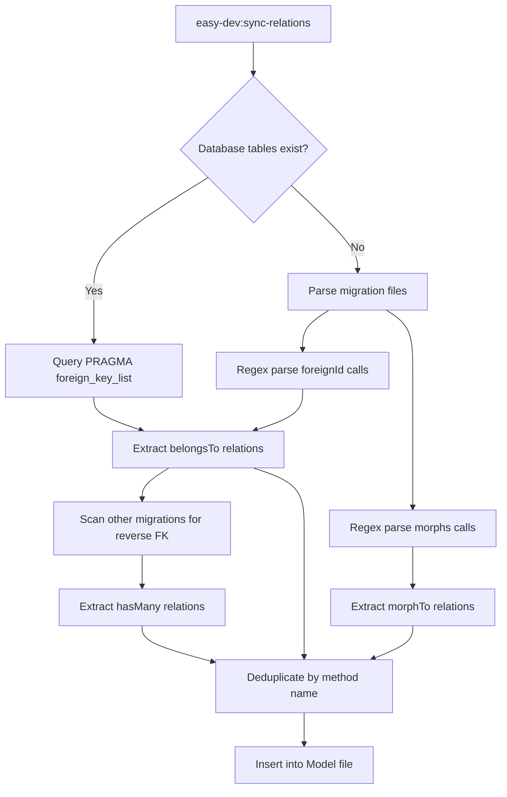

# 🚀 Laravel Easy Dev v3

[](https://packagist.org/packages/anas/easy-dev)
[](https://packagist.org/packages/anas/easy-dev)
[](LICENSE.md)
[](https://php.net)
[](https://laravel.com)

**Laravel Easy Dev** is an architectural code generation toolkit that supercharges your Laravel development. Generate complete CRUD systems with Repository & Service patterns, auto-detect model relationships, scaffold Clean Architecture (DDD) modules, and use natural language to dream up entire features — all with a beautiful interactive CLI and full AI agent integration.

> **What's New in v3?** Zero-config model autodiscovery, Clean Architecture (DDD) presets, AI-native JSON commands, automated service provider wiring, harmonized method signatures, and natural language scaffolding. [See the full changelog →](#-changelog)

---

## 📋 Table of Contents

- [Features](#-features)
- [Requirements](#-requirements)
- [Installation](#-installation)
- [Quick Start](#-quick-start)
- [Commands Reference](#-commands-reference)
  - [CRUD Generation](#1-easy-devcrud)
  - [Interactive CRUD](#2-easy-devmake)
  - [Natural Language Dream](#3-easy-devdream)
  - [Repository Generator](#4-easy-devrepository)
  - [API Resource Generator](#5-easy-devapi-resource)
  - [Policy Generator](#6-easy-devpolicy)
  - [DTO Generator](#7-easy-devdto)
  - [Observer Generator](#8-easy-devobserver)
  - [Filter Generator](#9-easy-devfilter)
  - [Enum Generator](#10-easy-devenum)
  - [Relationship Sync](#11-easy-devsync-relations)
  - [Add Relation](#12-easy-devadd-relation)
  - [AI Context](#13-easy-devai-context)
  - [Model Snapshot](#14-easy-devsnapshot)
  - [Model Info](#15-easy-devinfo)
  - [Publish Stubs](#16-easy-devpublish-stubs)
  - [Help](#17-easy-devhelp)
- [Architecture Presets](#-architecture-presets)
  - [Standard MVC](#standard-mvc-default)
  - [Clean Architecture (DDD)](#clean-architecture--ddd---presetclean)
- [Modular Architecture](#-modular-architecture)
- [Dry-Run Mode](#-dry-run-mode)
- [AI-Native Integration](#-ai-native-integration)
- [Configuration](#%EF%B8%8F-configuration)
- [Customizing Stubs](#-customizing-stubs)
- [Relationship Detection](#-relationship-detection)
- [Real-World Workflows](#-real-world-workflows)
- [Testing](#-testing)
- [Changelog](#-changelog)
- [Contributing](#-contributing)
- [License](#-license)

---

## ✨ Features

| Feature | Description |
|---------|-------------|
| 🏗️ **CRUD Generation** | Model, Migration, Controllers (API + Web), Requests, Resources, Routes |
| 🗄️ **Repository Pattern** | Repository + Interface with full CRUD method signatures |
| 🔧 **Service Layer** | Service + Interface with business logic separation |
| 🏛️ **Clean Architecture** | DDD presets with Domain, Application, Infrastructure, Presentation layers |
| 📦 **Modular Architecture** | Nest files inside domain modules (`app/Modules/Orders`) |
| 🤖 **AI-Native Integration** | Machine-friendly JSON commands for AI coding agents |
| 🔮 **Natural Language Scaffolding** | `easy-dev:dream` — scaffold features from English prompts |
| 🛡️ **Policies** | Authorization policy with 7 standard methods |
| 📦 **DTOs** | Data Transfer Objects with `fromRequest()`, `fromModel()`, `toArray()` |
| 👁️ **Observers** | Model lifecycle hooks (creating, created, updating, updated, deleting, deleted) |
| 🔍 **Query Filters** | Reusable filter classes with `apply()` method |
| 🏷️ **Enums** | PHP 8.1+ string-backed enums with `values()` and `label()` helpers |
| 🔄 **Relationship Detection** | Auto-detect `belongsTo`, `hasMany`, `morphTo`, `morphMany` from schema |
| 🎯 **Total Harmony** | Matching method signatures across Controller → Service → Repository |
| ⚡ **Auto Binding** | Automatic service provider creation and `bind()` injection |
| 🔮 **Dry-Run Mode** | Preview all files before creating — nothing is written to disk |
| ↩️ **Rollback** | Automatic cleanup on generation failure |
| 🎨 **Beautiful CLI** | Progress bars, colored output, interactive wizard |

---

## 📋 Requirements

- **PHP** 8.1 or higher
- **Laravel** 9.x / 10.x / 11.x / 12.x
- **Database** MySQL, PostgreSQL, or SQLite

---

## 📦 Installation

```bash
composer require anas/easy-dev --dev
```

The package auto-registers via Laravel package discovery. No manual setup needed.

### Publish Configuration (optional)

```bash
php artisan vendor:publish --tag=easy-dev-config
```

### Publish Stubs (optional)

```bash
php artisan easy-dev:publish-stubs
```

Stubs are copied to `resources/stubs/vendor/easy-dev/` where you can customize them. An AI skill instruction file (`easy-dev-ai.md`) is also published to your project root.

---

## 🚀 Quick Start

```bash
# 1. Generate a complete CRUD for "Product"
php artisan easy-dev:crud Product

# 2. Run the generated migration
php artisan migrate

# 3. Check your routes
php artisan route:list --path=products
```

That's it! You now have a Model, Migration, Web Controller, API Controller, Form Requests, API Resources, and Routes — all generated and ready to use.

### Want the full architecture stack?

```bash
php artisan easy-dev:crud Product --with-repository --with-service --with-policy --with-dto --with-observer
```

### Or use natural language?

```bash
php artisan easy-dev:dream "Create product catalog with name:string price:decimal stock:integer connected to categories"
```

---

## 📖 Commands Reference

### 1. `easy-dev:crud`

**The core command.** Generates a complete CRUD system for a model.

```bash
php artisan easy-dev:crud {model} [options]
```

#### Options

| Option | Description |
|--------|-------------|
| `--with-repository` | Generate Repository pattern (Repository + Interface) |
| `--with-service` | Generate Service layer (Service + Interface) |
| `--with-policy` | Generate authorization Policy |
| `--with-dto` | Generate Data Transfer Object |
| `--with-observer` | Generate model Observer |
| `--api-only` | Generate only API controller and routes (no web) |
| `--web-only` | Generate only web controller and routes (no API) |
| `--without-interface` | Skip Interface generation for Repository/Service |
| `--dry-run` | Preview files without creating them |
| `--stub=` | Override default stub template name or path |
| `--path=` | Override generation output directory |
| `--module=` | Place files inside a Domain Module (e.g. `Orders`) |
| `--preset=clean` | Use Clean Architecture / DDD folder layout |
| `--ai` | Silent machine-friendly JSON output |

#### Examples

```bash
# Basic CRUD (Model + Migration + Controllers + Requests + Resources + Routes)
php artisan easy-dev:crud Post

# Full architecture stack
php artisan easy-dev:crud Order --with-repository --with-service --with-policy --with-dto --with-observer

# API-only with service layer
php artisan easy-dev:crud Product --api-only --with-service

# Clean Architecture inside a module
php artisan easy-dev:crud Invoice --module=Billing --preset=clean --with-repository --with-service

# Preview what would be generated
php artisan easy-dev:crud Invoice --with-repository --with-service --dry-run
```

#### Generated Files (basic)

| File | Path |
|------|------|
| Model | `app/Models/Post.php` |
| Migration | `database/migrations/xxxx_create_posts_table.php` |
| Web Controller | `app/Http/Controllers/PostController.php` |
| API Controller | `app/Http/Controllers/Api/PostApiController.php` |
| Store Request | `app/Http/Requests/StorePostRequest.php` |
| Update Request | `app/Http/Requests/UpdatePostRequest.php` |
| API Resource | `app/Http/Resources/PostResource.php` |
| API Collection | `app/Http/Resources/PostCollection.php` |

#### Additional Files (with flags)

| Flag | Files Generated |
|------|----------------|
| `--with-repository` | `app/Repositories/PostRepository.php`, `app/Repositories/Contracts/PostRepositoryInterface.php` |
| `--with-service` | `app/Services/PostService.php`, `app/Services/Contracts/PostServiceInterface.php` |
| `--with-policy` | `app/Policies/PostPolicy.php` |
| `--with-dto` | `app/DTOs/PostData.php` |
| `--with-observer` | `app/Observers/PostObserver.php` |

---

### 2. `easy-dev:make`

**Interactive CRUD generator** with a guided wizard. Wraps `easy-dev:crud` with a beautiful step-by-step UI.

```bash
# Interactive mode (no arguments — wizard asks questions)
php artisan easy-dev:make

# Non-interactive mode (same options as easy-dev:crud)
php artisan easy-dev:make Product --with-repository --with-service

# With modular architecture
php artisan easy-dev:make Product --module=Sales --preset=clean
```

---

### 3. `easy-dev:dream`

**Natural language scaffolding.** Describe your feature in plain English, and the package builds everything.

```bash
php artisan easy-dev:dream "{prompt}" [--ai] [--dry-run] [--module=] [--preset=]
```

#### How It Parses Your Prompt

| Element | How It's Detected | Example |
|---------|-------------------|---------|
| **Model Name** | After verbs: `create`, `add`, `generate`, `make`, `new` | `Create **subscriptions**...` → `Subscription` |
| **Fields** | `field:type` or `field as type` syntax | `price:decimal`, `name as string` |
| **Relationships** | `connected to`, `belongs to`, `related to`, `linked to` | `connected to **users and products**` |
| **Articles** | Leading "A", "An", "The" are stripped automatically | `A new invoice...` → `Invoice` |

#### Examples

```bash
# Basic scaffolding
php artisan easy-dev:dream "Create customer subscriptions with price:decimal status:string connected to users and products"

# With module and clean architecture
php artisan easy-dev:dream "Add invoice items with quantity:integer unit_price:decimal connected to invoices" --module=Billing --preset=clean

# Dry run — preview only
php artisan easy-dev:dream "Create blog posts with title:string body:text connected to users and categories" --dry-run
```

#### What It Does Internally

1. Parses the prompt to extract model name, fields, and relationships
2. Calls `easy-dev:crud` with `--api --with-repository --with-service`
3. Enhances the generated migration with parsed columns and foreign keys
4. Runs `easy-dev:sync-relations` to wire up Eloquent relationships

---

### 4. `easy-dev:repository`

Generate repository pattern files for an existing model.

```bash
php artisan easy-dev:repository {model} [--without-interface] [--module=] [--preset=] [--ai]
```

**Generated files:**
- `app/Repositories/{Model}Repository.php`
- `app/Repositories/Contracts/{Model}RepositoryInterface.php`

---

### 5. `easy-dev:api-resource`

Generate API Resource and Collection classes for an existing model.

```bash
php artisan easy-dev:api-resource {model} [--without-collection] [--module=] [--preset=] [--ai]
```

**Generated files:**
- `app/Http/Resources/{Model}Resource.php`
- `app/Http/Resources/{Model}Collection.php`

---

### 6. `easy-dev:policy`

Generate an authorization policy for an existing model.

```bash
php artisan easy-dev:policy {model} [--module=] [--preset=] [--ai]
```

**Generated methods:** `viewAny`, `view`, `create`, `update`, `delete`, `restore`, `forceDelete`

---

### 7. `easy-dev:dto`

Generate a Data Transfer Object for a model.

```bash
php artisan easy-dev:dto {model} [--module=] [--preset=] [--ai]
```

**Generated methods:** `fromRequest(Request $request)`, `fromModel(Model $model)`, `toArray()`

---

### 8. `easy-dev:observer`

Generate a model observer with lifecycle hooks.

```bash
php artisan easy-dev:observer {model} [--module=] [--preset=] [--ai]
```

**Hooks:** `creating`, `created`, `updating`, `updated`, `deleting`, `deleted`

---

### 9. `easy-dev:filter`

Generate a query filter class for a model.

```bash
php artisan easy-dev:filter {model} [--module=] [--preset=] [--ai]
```

---

### 10. `easy-dev:enum`

Generate a PHP 8.1+ backed enum.

```bash
php artisan easy-dev:enum {name} --values={comma-separated} [--module=] [--preset=] [--ai]
```

**Example:**

```bash
php artisan easy-dev:enum OrderStatus --values=pending,processing,shipped,delivered,cancelled
```

**Generated code:**

```php
enum OrderStatus: string
{
    case PENDING = 'pending';
    case PROCESSING = 'processing';
    case SHIPPED = 'shipped';
    case DELIVERED = 'delivered';
    case CANCELLED = 'cancelled';

    public static function values(): array { ... }
    public function label(): string { ... }
}
```

---

### 11. `easy-dev:sync-relations`

Auto-detect relationships from your database schema or migration files and add them to models.

```bash
# Sync a specific model
php artisan easy-dev:sync-relations Product

# Sync ALL models
php artisan easy-dev:sync-relations --all
```

**Detects:**
- `belongsTo` — from `foreignId` columns in the model's migration
- `hasMany` — by scanning other migrations for foreign keys referencing this model
- `morphTo` / `morphMany` — from `$table->morphs()` columns

---

### 12. `easy-dev:add-relation`

Manually add a relationship method to an existing model.

```bash
php artisan easy-dev:add-relation {model} {relation} {related-model} [--method=name]
```

**Supported relation types:** `hasOne`, `hasMany`, `belongsTo`, `belongsToMany`, `morphTo`, `morphOne`, `morphMany`

---

### 13. `easy-dev:ai-context`

Output a comprehensive context map for AI agents — paths, modules, stubs, models, columns, relationships, and commands reference.

```bash
php artisan easy-dev:ai-context [--pretty]
```

---

### 14. `easy-dev:snapshot`

Generate a high-density, token-efficient snapshot of all models, schemas, and relationships.

```bash
php artisan easy-dev:snapshot [--ai]
```

---

### 15. `easy-dev:info`

Output detailed model audit data — schema columns, fillable/hidden/casts, relationships, and form requests.

```bash
php artisan easy-dev:info {model} [--ai]
```

---

### 16. `easy-dev:publish-stubs`

Publish package stub templates to your application for customization.

```bash
# List available stubs
php artisan easy-dev:publish-stubs --list

# Publish all stubs
php artisan easy-dev:publish-stubs

# Publish specific stubs only
php artisan easy-dev:publish-stubs --only=controller.api.enhanced,service.enhanced
```

---

### 17. `easy-dev:help`

Display the built-in help guide.

```bash
php artisan easy-dev:help
php artisan easy-dev:help --examples
```

---

## 🏛️ Architecture Presets

### Standard MVC (default)

When you run `easy-dev:crud` with all flags, the generated file structure follows standard Laravel conventions:

```
app/
├── DTOs/
│   └── ProductData.php
├── Enums/
│   └── ProductStatus.php
├── Filters/
│   └── ProductFilter.php
├── Http/
│   ├── Controllers/
│   │   ├── ProductController.php
│   │   └── Api/
│   │       └── ProductApiController.php
│   ├── Requests/
│   │   ├── StoreProductRequest.php
│   │   └── UpdateProductRequest.php
│   └── Resources/
│       ├── ProductResource.php
│       └── ProductCollection.php
├── Models/
│   └── Product.php
├── Observers/
│   └── ProductObserver.php
├── Policies/
│   └── ProductPolicy.php
├── Repositories/
│   ├── ProductRepository.php
│   └── Contracts/
│       └── ProductRepositoryInterface.php
└── Services/
    ├── ProductService.php
    └── Contracts/
        └── ProductServiceInterface.php
```

### Clean Architecture / DDD (`--preset=clean`)

Use `--preset=clean` with `--module=` to generate a professional 4-layer Domain-Driven Design structure:

```bash
php artisan easy-dev:crud Product --module=Catalog --preset=clean --with-repository --with-service --with-policy --with-dto
```

```
app/Modules/Catalog/
├── Domain/                          # Core business rules
│   ├── Models/
│   │   └── Product.php
│   ├── Enums/
│   │   └── ProductStatus.php
│   └── Repositories/               # Repository contracts (domain owns the interfaces)
│       └── ProductRepositoryInterface.php
│
├── Application/                     # Use cases & orchestration
│   ├── Services/
│   │   ├── ProductService.php
│   │   └── ProductServiceInterface.php
│   └── DTOs/
│       └── ProductData.php
│
├── Infrastructure/                  # External concerns
│   ├── Repositories/
│   │   └── ProductRepository.php   # Repository implementation
│   ├── Policies/
│   │   └── ProductPolicy.php
│   ├── Observers/
│   │   └── ProductObserver.php
│   ├── Filters/
│   │   └── ProductFilter.php
│   └── Providers/
│       └── CatalogServiceProvider.php   # Auto-managed bindings
│
└── Presentation/                    # HTTP layer
    └── Http/
        ├── Controllers/
        │   ├── ProductController.php
        │   └── Api/
        │       └── ProductApiController.php
        ├── Requests/
        │   ├── StoreProductRequest.php
        │   └── UpdateProductRequest.php
        └── Resources/
            ├── ProductResource.php
            └── ProductCollection.php
```

**Key behaviors with `--preset=clean`:**
- Repository **interfaces** go in `Domain/Repositories/` (contracts belong to the domain)
- Repository **implementations** go in `Infrastructure/Repositories/`
- Existing `Providers/` directory is automatically relocated to `Infrastructure/Providers/`
- Service Provider `bind()` calls are auto-injected
- `module.json` namespace references are auto-updated
- Empty directories are automatically cleaned up
- All `use` import statements and namespaces are dynamically rewritten

---

## 📦 Modular Architecture

Even without `--preset=clean`, you can use `--module=` to organize files by domain:

```bash
php artisan easy-dev:crud Order --module=Sales --with-repository --with-service
```

This generates all files under `app/Modules/Sales/`:

```
app/Modules/Sales/
├── Models/Order.php
├── Http/Controllers/OrderController.php
├── Http/Controllers/Api/OrderApiController.php
├── Http/Requests/StoreOrderRequest.php
├── Http/Requests/UpdateOrderRequest.php
├── Http/Resources/OrderResource.php
├── Repositories/OrderRepository.php
├── Repositories/Contracts/OrderRepositoryInterface.php
├── Services/OrderService.php
├── Services/Contracts/OrderServiceInterface.php
└── Providers/SalesServiceProvider.php  ← auto-created with bindings
```

Module path is configurable via `config/easy-dev.php` → `modules.path`.

---

## 🔮 Dry-Run Mode

Preview exactly what would be generated — without writing a single file:

```bash
php artisan easy-dev:crud Invoice --with-repository --with-service --with-policy --dry-run
```

---

## 🤖 AI-Native Integration

This package is designed from the ground up to be **AI-Native**, allowing developer assistants (Cursor, Gemini, Claude, Copilot, Antigravity, etc.) to scaffold and manage your codebase with 100% precision.

### 🧠 AI Skill Instructions

Any AI agent working on this repository or using this package can read the complete prompt blueprint instructions in **[SKILL.md](SKILL.md)**.

When you run `php artisan easy-dev:publish-stubs`, a copy of this instruction file is automatically published to your project root as **`easy-dev-ai.md`**.

### 🔮 Context Discovery

AI agents can execute the context discovery command to instantly map out your configurations, output folders, stubs, active database tables, columns, constraints, and Eloquent relationships:

```bash
php artisan easy-dev:ai-context --pretty
```

### 📸 Schema Snapshot

Token-efficient snapshot of all models and their schemas:

```bash
php artisan easy-dev:snapshot --ai
```

### 🔍 Single Model Audit

```bash
php artisan easy-dev:info Product --ai
```

### 🔕 Silent JSON Mode

Every generator command accepts the `--ai` flag to suppress terminal output and return **structured JSON**:

```json
{
  "status": "success",
  "command": "easy-dev:crud",
  "model": "Product",
  "generated": [
    {
      "type": "repository",
      "name": "ProductRepository",
      "path": "app/Repositories/ProductRepository.php",
      "stub_used": "resources/stubs/repository.enhanced.stub"
    }
  ]
}
```

On error:

```json
{
  "status": "error",
  "message": "Description of what went wrong",
  "suggestions": ["How to fix it"]
}
```

---

## ⚙️ Configuration

After publishing the config (`php artisan vendor:publish --tag=easy-dev-config`), edit `config/easy-dev.php`:

### Key Configuration Sections

<details>
<summary><strong>Model Namespace</strong></summary>

```php
'model_namespace' => 'App\\Models\\',
```
</details>

<details>
<summary><strong>File Output Paths</strong> (17 file types)</summary>

```php
'paths' => [
    'models'              => app_path('Models'),
    'controllers'         => app_path('Http/Controllers'),
    'api_controllers'     => app_path('Http/Controllers/Api'),
    'requests'            => app_path('Http/Requests'),
    'repositories'        => app_path('Repositories'),
    'repository_contracts' => app_path('Repositories/Contracts'),
    'services'            => app_path('Services'),
    'service_contracts'   => app_path('Services/Contracts'),
    'policies'            => app_path('Policies'),
    'dtos'                => app_path('DTOs'),
    'observers'           => app_path('Observers'),
    'filters'             => app_path('Filters'),
    'enums'               => app_path('Enums'),
    'resources'           => app_path('Http/Resources'),
    'tests'               => base_path('tests'),
    'factories'           => database_path('factories'),
    'migrations'          => database_path('migrations'),
],
```
</details>

<details>
<summary><strong>Modular Architecture</strong></summary>

```php
'modules' => [
    'enabled' => false,
    'path' => 'app/Modules',
    'namespaces' => [
        'models'               => 'Models',
        'controllers'          => 'Http/Controllers',
        'api_controllers'      => 'Http/Controllers/Api',
        'requests'             => 'Http/Requests',
        'repositories'         => 'Repositories',
        'repository_contracts' => 'Repositories/Contracts',
        'services'             => 'Services',
        'service_contracts'    => 'Services/Contracts',
        // ... and more
    ],
],
```
</details>

<details>
<summary><strong>Route Configuration</strong></summary>

```php
'routes' => [
    'api_prefix'          => 'api',
    'web_prefix'          => '',
    'web_middleware'       => ['web'],
    'api_middleware'       => ['api'],
    'route_model_binding' => true,
],
```
</details>

<details>
<summary><strong>Default Options</strong></summary>

```php
'defaults' => [
    'with_repository'          => false,
    'with_service'             => false,
    'with_interface'           => true,
    'generate_api_controller'  => true,
    'generate_web_controller'  => true,
    'generate_tests'           => false,
    'generate_factory'         => false,
    'generate_seeder'          => false,
],
```
</details>

<details>
<summary><strong>Validation Rules</strong></summary>

```php
'validation' => [
    'rules' => [
        'string'   => 'required|string|max:255',
        'integer'  => 'required|integer',
        'decimal'  => 'required|numeric',
        'boolean'  => 'required|boolean',
        'date'     => 'required|date',
        'email'    => 'required|email|max:255',
        'json'     => 'required|json',
        // ... and more
    ],
    'field_patterns' => [
        'email'    => 'required|email|max:255',
        'password' => 'required|string|min:8',
        'slug'     => 'required|string|max:255|unique:{table}',
        '_id'      => 'required|integer|exists:{table},id',
        // ... and more
    ],
],
```
</details>

<details>
<summary><strong>Relationship Detection</strong></summary>

```php
'relationships' => [
    'auto_detect'                   => true,
    'detect_polymorphic'            => true,
    'generate_reverse_relationships' => true,
    'foreign_key_suffix'            => '_id',
    'polymorphic_suffix'            => '_type',
],
```
</details>

<details>
<summary><strong>UI Settings</strong></summary>

```php
'ui' => [
    'show_progress_bar'        => true,
    'show_banner'              => true,
    'use_icons'                => true,
    'colored_output'           => true,
    'interactive_mode_default' => false,
],
```
</details>

---

## 🎨 Customizing Stubs

Publish stubs with `php artisan easy-dev:publish-stubs`, then customize any template in `resources/stubs/vendor/easy-dev/`.

### Available Stubs (34 total)

| Category | Stubs |
|----------|-------|
| **Models** | `model.stub` |
| **Controllers** | `controller.stub`, `controller.enhanced.stub`, `controller.api.stub`, `controller.api.enhanced.stub`, `controller.repository.stub`, `controller.api.service.stub`, `controller.web.service.stub` |
| **Repository** | `repository.stub`, `repository.enhanced.stub`, `repository.interface.stub`, `repository.interface.enhanced.stub` |
| **Service** | `service.stub`, `service.enhanced.stub`, `service.interface.stub`, `service.interface.enhanced.stub` |
| **Requests** | `request.store.stub`, `request.update.stub`, `request.enhanced.stub` |
| **Resources** | `api.resource.stub`, `api.collection.stub` |
| **Generators** | `policy.stub`, `dto.stub`, `observer.stub`, `filter.stub`, `enum.stub` |
| **Relations** | `belongsTo.stub`, `hasOne.stub`, `hasMany.stub`, `belongsToMany.stub`, `morphTo.stub`, `morphOne.stub`, `morphMany.stub` |
| **Other** | `factory.stub` |

### Stub Resolution Chain

The package resolves stubs using a 4-layer chain:

1. **CLI override** — `--stub=path/to/custom.stub`
2. **Published stubs** — `resources/stubs/vendor/easy-dev/*.stub`
3. **Config mapping** — `config/easy-dev.php` → `stubs` section
4. **Package defaults** — built-in stubs (fallback)

### Stub Variables

All stubs use `{{ variable }}` placeholders:

| Variable | Description | Example |
|----------|-------------|---------|
| `{{ ModelName }}` | PascalCase model name | `Product` |
| `{{ modelName }}` | camelCase model name | `product` |
| `{{ tableName }}` | snake_case plural table | `products` |
| `{{ namespace }}` | Auto-resolved PSR-4 namespace | `App\Repositories` |
| `{{ RepositoryName }}` | Repository class name | `ProductRepository` |
| `{{ InterfaceName }}` | Interface class name | `ProductRepositoryInterface` |
| `{{ ServiceName }}` | Service class name | `ProductService` |
| `{{ fillable }}` | Fillable fields array | `['name', 'price']` |
| `{{ validationRules }}` | Validation rules | `'name' => 'required\|string'` |

---

## 🔄 Relationship Detection

The `sync-relations` command uses a multi-source approach:


```mermaid
graph TD
    A[easy-dev:sync-relations] --> B{Database tables exist?}
    B -->|Yes| C[Query PRAGMA foreign_key_list]
    B -->|No| D[Parse migration files]
    C --> E[Extract belongsTo relations]
    D --> F[Regex parse foreignId calls]
    D --> G[Regex parse morphs calls]
    F --> E
    G --> H[Extract morphTo relations]
    E --> I[Scan other migrations for reverse FK]
    I --> J[Extract hasMany relations]
    E & H & J --> K[Deduplicate by method name]
    K --> L[Insert into Model file]
```

**Detection sources:**
1. **Database schema** — `PRAGMA foreign_key_list` (SQLite) or `information_schema` (MySQL/PgSQL)
2. **Migration files** — Regex parsing of `foreignId()`, `constrained()`, and `morphs()` calls
3. **Cross-migration scanning** — finds reverse relationships in other migration files

---

## 💼 Real-World Workflows

### E-Commerce Product Catalog

```bash
# 1. Create the enum for product status
php artisan easy-dev:enum ProductStatus --values=draft,active,archived

# 2. Create the full Product CRUD with all layers
php artisan easy-dev:crud Product --with-repository --with-service --with-policy --with-dto --with-observer

# 3. Create Category with basic CRUD
php artisan easy-dev:crud Category

# 4. Run migrations
php artisan migrate

# 5. Auto-detect relationships between Product and Category
php artisan easy-dev:sync-relations --all

# 6. Add a filter for product queries
php artisan easy-dev:filter Product
```

### Clean Architecture Microservice

```bash
# Scaffold a complete Billing module with DDD structure
php artisan easy-dev:crud Invoice --module=Billing --preset=clean --with-repository --with-service --with-policy --with-dto

php artisan easy-dev:crud Payment --module=Billing --preset=clean --with-repository --with-service

php artisan easy-dev:enum PaymentStatus --values=pending,completed,failed,refunded --module=Billing --preset=clean

php artisan migrate

php artisan easy-dev:sync-relations --all
```

### Natural Language Rapid Prototyping

```bash
# Dream up features from English descriptions
php artisan easy-dev:dream "Create customer subscriptions with plan:string price:decimal start_date:date connected to users"

php artisan easy-dev:dream "Add invoice line items with quantity:integer unit_price:decimal connected to invoices and products"

php artisan migrate
php artisan easy-dev:sync-relations --all
```

### Adding to an Existing Model

```bash
# Add repository pattern to existing model
php artisan easy-dev:repository Customer

# Add API resources
php artisan easy-dev:api-resource Customer

# Add relationships manually
php artisan easy-dev:add-relation Customer hasMany Order
php artisan easy-dev:add-relation Order belongsTo Customer
```

---

## 🧪 Testing

The package includes a comprehensive test suite:

```bash
cd packages/laravel-easy-dev
composer test

# Or with testdox output
vendor/bin/phpunit --testdox
```

---

## 📝 Changelog

### v3.0 — Architectural Orchestrator Release

| Feature | What Changed |
|---------|-------------|
| **Zero-Config Autodiscovery** | Recursive model scanning — works with any namespace |
| **Clean Architecture Presets** | `--preset=clean` scaffolds 4-layer DDD structure |
| **AI-Native Commands** | `ai-context`, `snapshot`, `info` — JSON-first design |
| **Silent JSON Mode** | `--ai` flag on every command for programmatic use |
| **Natural Language Dream** | Article filtering, architecture awareness, better relationship parsing |
| **Total Harmony Stubs** | Matching method signatures across Controller → Service → Repository |
| **Smart Modular Automation** | Auto provider relocation, auto binding injection |
| **Provider Auto-Wiring** | `bind()` logic auto-injected into Service Providers |
| **Namespace Rewriting** | Dynamic PSR-4 namespace + import translation |

---

## 🤝 Contributing

Contributions are welcome! Please follow these steps:

1. Fork the repository
2. Create your feature branch: `git checkout -b feature/amazing-feature`
3. Run the test suite: `composer test`
4. Commit your changes: `git commit -m 'Add amazing feature'`
5. Push to the branch: `git push origin feature/amazing-feature`
6. Open a Pull Request

---

## 📄 License

The MIT License (MIT). See [LICENSE.md](LICENSE.md) for details.

## 👨‍💻 Credits

- [Anas Nashaat](https://github.com/anasnashat)
- [All Contributors](https://github.com/anasnashat/laravel-easy-dev/contributors)

---

<div align="center">

**Made with ❤️ for the Laravel community**

[⭐ Star on GitHub](https://github.com/anasnashat/laravel-easy-dev) • [🐛 Report Issues](https://github.com/anasnashat/laravel-easy-dev/issues) • [💬 Discussions](https://github.com/anasnashat/laravel-easy-dev/discussions)

</div>
