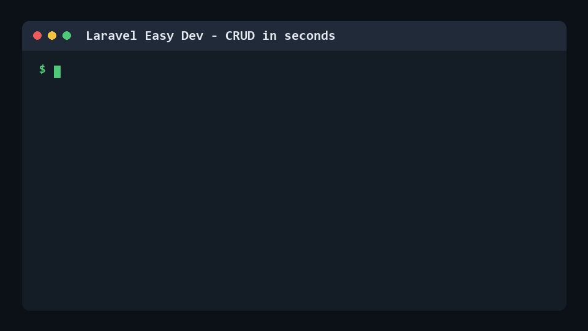
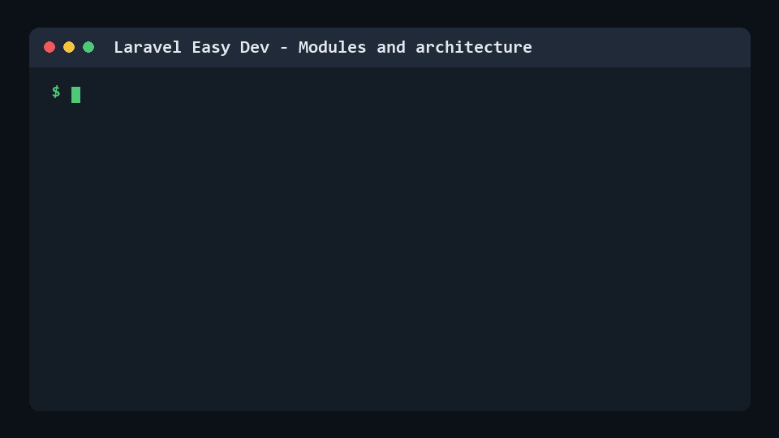
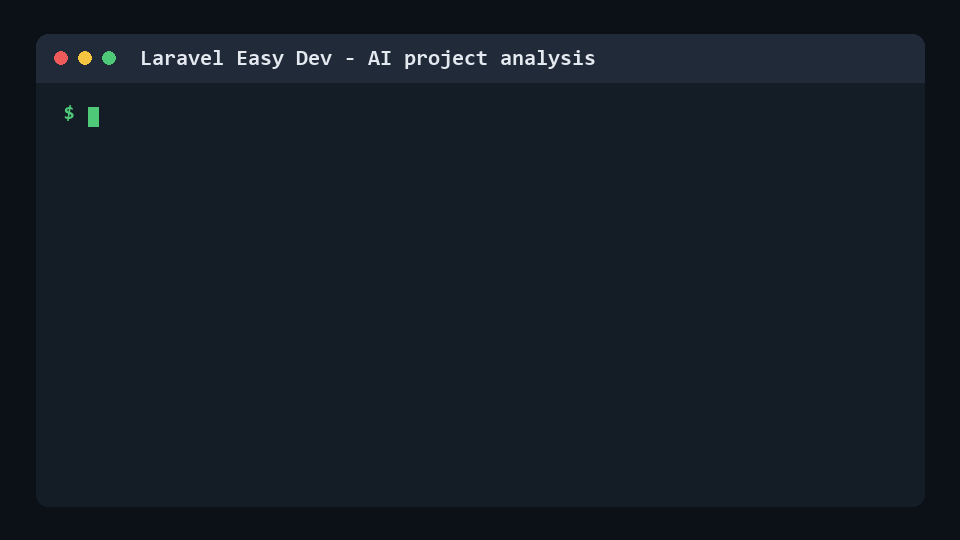

# Laravel Easy Dev

Generate production-style Laravel CRUD, API, architecture layers, tests, docs, and AI-ready project context from one command.

[](https://packagist.org/packages/anas/easy-dev)
[](https://packagist.org/packages/anas/easy-dev)
[](LICENSE.md)
[](https://php.net)
[](https://laravel.com)

## Hero Section

Laravel Easy Dev solves the repetitive work that slows down every Laravel project: controllers, requests, resources, routes, repositories, services, policies, DTOs, observers, tests, OpenAPI docs, and module folders.

Instead of spending 30 to 90 minutes wiring the same structure for every model, run one Artisan command and start from a consistent, team-ready architecture.

```bash
php artisan easy-dev:crud Product --api --with-repository --with-service --with-policy --with-dto --tests --swagger
```

What you get:

- Complete CRUD scaffolding for web and API projects
- Optional Repository and Service layers with interfaces
- Form Requests, API Resources, routes, policies, DTOs, observers, filters, enums, and tests
- Clean Architecture and DDD-style module layouts
- AI-friendly JSON commands for coding agents and project analysis
- Customizable stubs for your team's conventions

Best fit:

- Laravel APIs
- Admin panels
- SaaS dashboards
- modular monoliths
- domain-driven Laravel apps
- teams that want consistent generated code

### Demo GIFs

#### CRUD in seconds



#### Module and architecture scaffolding



#### AI project analysis



## Installation

Install the package as a development dependency:

```bash
composer require anas/easy-dev --dev
```

Laravel package discovery registers the service provider automatically.

Publish the config when you want to customize paths, defaults, routes, validation rules, or module settings:

```bash
php artisan vendor:publish --tag=easy-dev-config
```

Publish stubs when you want generated code to match your team's exact style:

```bash
php artisan easy-dev:publish-stubs
```

Published stubs are placed in:

```text
resources/stubs/vendor/easy-dev/
```

## Quick Example

Generate a standard CRUD:

```bash
php artisan easy-dev:crud Product
```

Run the migration:

```bash
php artisan migrate
```

Check the generated routes:

```bash
php artisan route:list --path=products
```

Generate an API-first CRUD with a fuller application structure:

```bash
php artisan easy-dev:crud Product \
  --api \
  --with-repository \
  --with-service \
  --with-policy \
  --with-dto \
  --with-observer \
  --register-observer \
  --tests \
  --swagger
```

Preview without writing files:

```bash
php artisan easy-dev:crud Product --with-repository --with-service --dry-run
```

Generate from natural language:

```bash
php artisan easy-dev:dream "Create product catalog with name:string price:decimal stock:integer connected to categories"
```

## Generated Files

Basic CRUD generation creates:

```text
app/
  Models/Product.php
  Http/Controllers/ProductController.php
  Http/Controllers/Api/ProductApiController.php
  Http/Requests/StoreProductRequest.php
  Http/Requests/UpdateProductRequest.php
  Http/Resources/ProductResource.php
  Http/Resources/ProductCollection.php
database/
  migrations/xxxx_xx_xx_xxxxxx_create_products_table.php
routes/
  web.php
  api.php
```

Optional flags add:

| Flag | Generated output |
| --- | --- |
| `--with-repository` | `app/Repositories/ProductRepository.php`, `app/Repositories/Contracts/ProductRepositoryInterface.php` |
| `--with-service` | `app/Services/ProductService.php`, `app/Services/Contracts/ProductServiceInterface.php` |
| `--with-policy` | `app/Policies/ProductPolicy.php` |
| `--with-dto` | `app/DTOs/ProductData.php` |
| `--with-observer` | `app/Observers/ProductObserver.php` |
| `--register-observer` | Adds `#[ObservedBy]` registration to the model |
| `--tests` | `tests/Feature/ProductControllerTest.php`, unit test shells |
| `--swagger` | `storage/app/easy-dev/openapi.json` |
| `--vue` | `resources/js/components/ProductsIndex.vue` |
| `--react` | `resources/js/components/ProductsIndex.jsx` |
| `--inertia` | `resources/js/Pages/Products/Index.vue` |
| `--livewire` | Livewire class and Blade view |

## Advanced Features

### API-First Mode

Use `--api` or `--api-only` to skip web controllers and focus on API resources.

```bash
php artisan easy-dev:crud Product --api --with-service --tests --swagger
```

### Repository and Service Layers

Generate clean separation between HTTP, business logic, and persistence:

```bash
php artisan easy-dev:crud Order --with-repository --with-service
```

### Architecture Presets

Use standard Laravel structure:

```bash
php artisan easy-dev:crud Invoice --architecture=laravel
```

Use Clean Architecture layout inside a module:

```bash
php artisan easy-dev:crud Invoice --module=Billing --architecture=clean --with-repository --with-service
```

Use DDD-style module layout:

```bash
php artisan easy-dev:crud Payment --module=Billing --architecture=ddd --with-repository --with-service
```

### Modules

Place generated files under a domain module:

```bash
php artisan easy-dev:crud Order --module=Sales --with-repository --with-service
```

Example module output:

```text
app/Modules/Sales/
  Models/Order.php
  Http/Controllers/OrderController.php
  Http/Controllers/Api/OrderApiController.php
  Http/Requests/StoreOrderRequest.php
  Http/Requests/UpdateOrderRequest.php
  Http/Resources/OrderResource.php
  Repositories/OrderRepository.php
  Repositories/Contracts/OrderRepositoryInterface.php
  Services/OrderService.php
  Services/Contracts/OrderServiceInterface.php
```

### Test Generation

Generate starter tests for a model:

```bash
php artisan easy-dev:test Product
```

Generate API, service, and repository test shells:

```bash
php artisan easy-dev:test Product --api --feature --unit --service --repository
```

### OpenAPI Generation

Generate a basic OpenAPI file:

```bash
php artisan easy-dev:swagger Product
```

Generate YAML:

```bash
php artisan easy-dev:swagger Product --format=yaml
```

### Project Analysis

Analyze project structure and missing layers:

```bash
php artisan easy-dev:analyze
```

Machine-readable output for AI tools:

```bash
php artisan easy-dev:analyze --json
```

Apply conservative safe fixes where available:

```bash
php artisan easy-dev:analyze --fix
```

### Relationship Management

Auto-detect relationships from database schema and migrations:

```bash
php artisan easy-dev:sync-relations --all
```

Add a relationship manually:

```bash
php artisan easy-dev:add-relation Post belongsTo User
```

### Individual Generators

Use each generator independently:

```bash
php artisan easy-dev:repository Product
php artisan easy-dev:api-resource Product
php artisan easy-dev:policy Product
php artisan easy-dev:dto Product
php artisan easy-dev:observer Product --register
php artisan easy-dev:filter Product
php artisan easy-dev:enum OrderStatus --values=pending,paid,cancelled
```

### Frontend Starters

Generate backend plus starter frontend files:

```bash
php artisan easy-dev:crud Product --inertia
php artisan easy-dev:crud Product --vue
php artisan easy-dev:crud Product --react
php artisan easy-dev:crud Product --livewire
```

These files are intentionally starter templates. They give you a consistent first screen to customize for your actual UI stack.

### AI-Native Commands

Give AI coding agents structured project context:

```bash
php artisan easy-dev:ai-context --pretty
php artisan easy-dev:snapshot --ai
php artisan easy-dev:info Product --ai
```

All major generators support `--ai` for quiet JSON output:

```bash
php artisan easy-dev:crud Product --api --ai
```

## Customization

Publish stubs:

```bash
php artisan easy-dev:publish-stubs
```

List available stubs:

```bash
php artisan easy-dev:publish-stubs --list
```

Publish only selected stubs:

```bash
php artisan easy-dev:publish-stubs --only=controller.api,service.enhanced
```

Overwrite existing published stubs:

```bash
php artisan easy-dev:publish-stubs --force
```

Stub resolution order:

1. CLI `--stub=...`
2. published project stubs
3. `config/easy-dev.php` stub mapping
4. package default stubs

## Configuration

Publish config:

```bash
php artisan vendor:publish --tag=easy-dev-config
```

Common settings:

- output paths for models, controllers, resources, repositories, services, policies, DTOs, observers, enums, tests, factories, and migrations
- route middleware and route prefixes
- default generator options
- validation rule mapping
- relationship detection behavior
- module root path and module namespace structure

## Command Reference

Primary commands:

| Command | Purpose |
| --- | --- |
| `easy-dev:crud` | Generate CRUD and optional architecture layers |
| `easy-dev:make` | Interactive CRUD wizard |
| `easy-dev:dream` | Generate from natural language |
| `easy-dev:test` | Generate feature and unit test shells |
| `easy-dev:swagger` | Generate OpenAPI docs |
| `easy-dev:analyze` | Analyze missing layers and maintainability risks |
| `easy-dev:ai-context` | Export AI-ready project context |
| `easy-dev:snapshot` | Snapshot models, schemas, and relationships |
| `easy-dev:info` | Inspect one model |
| `easy-dev:publish-stubs` | Publish customizable stubs |

Pattern generators:

| Command | Purpose |
| --- | --- |
| `easy-dev:repository` | Repository and interface |
| `easy-dev:api-resource` | API resource and collection |
| `easy-dev:policy` | Authorization policy |
| `easy-dev:dto` | Data Transfer Object |
| `easy-dev:observer` | Model observer |
| `easy-dev:filter` | Query filter |
| `easy-dev:enum` | PHP enum |
| `easy-dev:sync-relations` | Detect and sync model relationships |
| `easy-dev:add-relation` | Add one relationship manually |

## Requirements

- PHP 8.1+
- Laravel 9, 10, 11, 12, or 13
- MySQL, PostgreSQL, or SQLite for schema analysis features

## Testing

Run the package tests:

```bash
cd packages/laravel-easy-dev
composer test
```

Current local verification:

```text
97 tests, 396 assertions
```

## Release Status

Laravel Easy Dev v3.1.0 is stable and ready for Laravel project use. The next best improvements are:

- CI runs across PHP 8.1, 8.2, 8.3, and 8.4
- field-aware OpenAPI schemas from migrations
- richer frontend route and controller integration
- more precise analyzer rules and safe fixers

## License

The MIT License. See [LICENSE.md](LICENSE.md) for details.

## Credits

- [Anas Nashaat](https://github.com/anasnashat)
